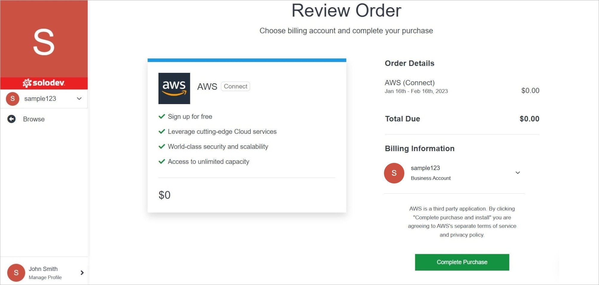
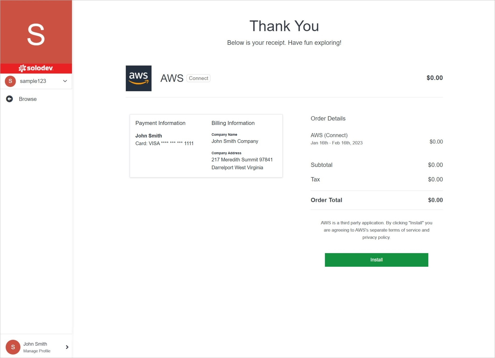
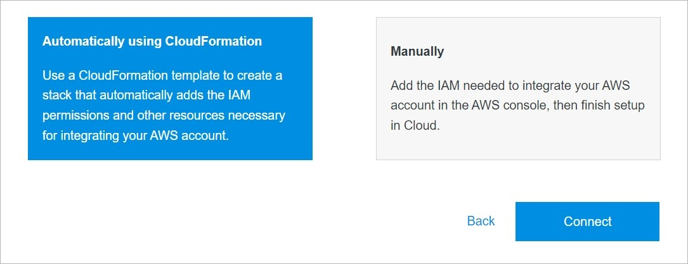

# Add Cloud Account

Adding a cloud account in Solodev Cloud is a simple process, and can be completed in minutes by following the steps below.

</a>

**Name** | **Description** 
:--- | ---
Product Selection | Select the provider you are interested in by clicking on the button on the product card.

</a>

**Name** | **Description** 
:--- | ---
Install for free | Click this button to go one step further, selecting a product type before.

</a>

**Name** | **Description** 
:--- | ---
Complete Purchase | Click this button to complete your purchase.

</a>

**Name** | **Description** 
:--- | ---
Install | Install the product.

</a>

**Name** | **Description** 
:--- | ---
Login to AWS Account | Log in to your AWS account.
IAM Role & Policy | Create IAM Role & Policy following the instruction.
Name | Enter the provider's name.
Region | Choose the region.
Access Key ID | Enter the Access Key ID.
Secret Access Key | Enter the Secret Access Key.

## Confirm

Once you have completed all the fields, click **Connect** to add your cloud account.

!!!Note:
The cloud account addition process may take several minutes to complete after clicking the **Connect** button. Do not close or quit your browser during this process.
!!!
