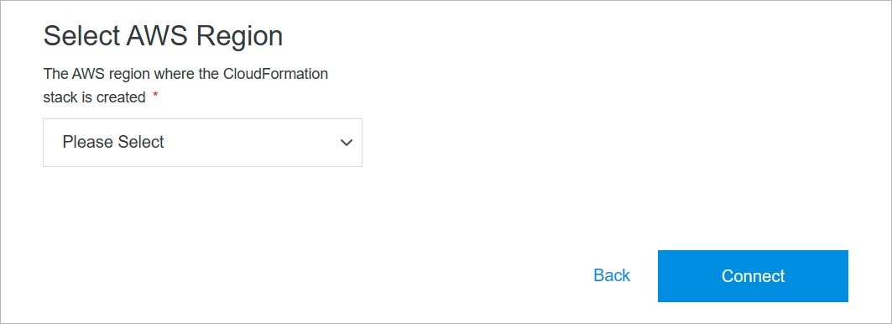

# Add Provider

Adding a provider in Solodev Cloud is a simple process that can be completed in minutes by following the steps below.

</a>

**Name** | **Description** 
:--- | ---
Product Selection | Select the provider you are interested in by clicking on the button on the product card.

</a>

**Name** | **Description** 
:--- | ---
Install for free | Click this button to go one step further, selecting a product type before.

</a>

**Name** | **Description** 
:--- | ---
Complete Purchase | Click this button to complete your purchase.

</a>

**Name** | **Description** 
:--- | ---
Install | Install the product.

</a>

**Name** | **Description** 
:--- | ---
<a href="/infrastructure/providers/add-cloud-account/#automatically-using-cloud-formation">Automatically Using AWS CloudFormation</a> | Use a AWS CloudFormation template to create a stack that automatically adds the IAM permissions and other resources necessary for integrating your AWS account.
<a href="/infrastructure/providers/add-cloud-account/#manually">Manually</a> | Add the IAM needed to integrate your AWS account in the AWS console, then finish setup in Cloud.

## Automatically Using AWS CloudFormation

Use the automatic mode.

</a>

**Name** | **Description** 
:--- | ---
Select AWS Region | Choose the region where the AWS CloudFormation stack is created.

## Add Provider Manually

Use the manual mode.

</a>

**Name** | **Description** 
:--- | ---
Credentials Type | Choose the credentials type. Ypu can choose from **Role Delegation** and **Access Key**. In case of **Access Key** you will be asked to provide more details as: name, AWS access and secret keys.

</a>

**Name** | **Description** 
:--- | ---
Name | Enter the name.
AWS Access Key | Enter the AWS Access Key.
AWS Secret Key | Enter the Secret Key.

## Confirm

Once you have completed all the fields, click **Connect** to add the provider.

!!!Note:
The provider addition process may take several minutes to complete after clicking the **Connect** button. Do not close or quit your browser during this process.
!!!
