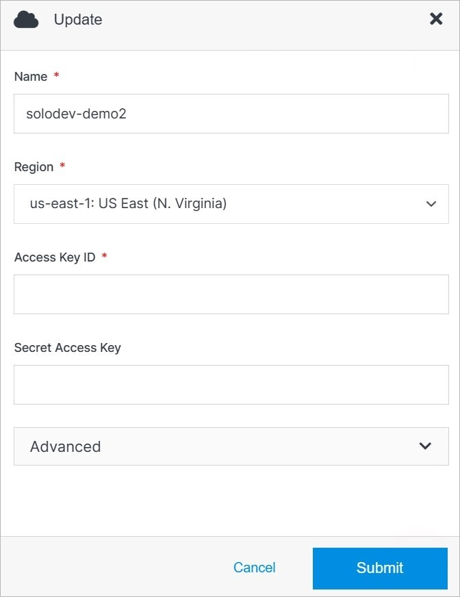
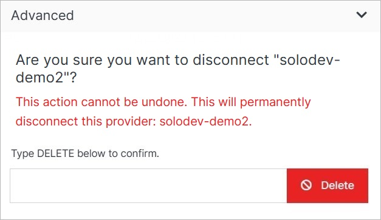

# Update

Update a provider's details or delete a provider from your Solodev Cloud by clicking the **Update** button on the Provider Overview page.

></a>

**Name** | **Description** 
:--- | ---
Name | Enter the provider's name.
Region | Choose the region.
Access Key ID | Enter the Access Key ID.
Secret Access Key | Enter the Secret Access Key.

## Advanced

Under the Advanced dropdown, you can execute advanced operations such as deleting a provider. 
></a>

**Name** | **Description** 
:--- | ---
Delete | To remove your provider, type **DELETE** in all caps into the field and click the red Delete button.

!!! Note:
Deleting a provider will permanently remove the provider and all of its content and cannot be undone.
!!!

## Confirm

Once you have completed all the fields, click **Submit** to apply your changes.

