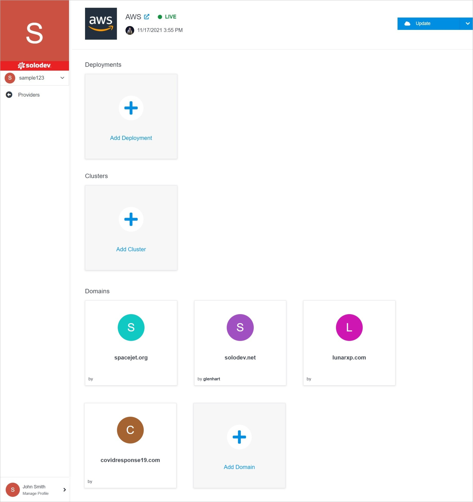

# Provider Overview

The Provider Overview page gives you the ability to manage your providers. Do it by updating details, modifying permissions for members, managing deployments, clusters and 
domains.

</a>

!!!Note:
The specificity of each product is different, therefore the options that are available after opening the container card differ. Universal options that appear for almost every container are **Update**, **Permissions**, **Add Deployment, Cluster, or Domain**.
!!!

**Name** | **Description** 
:--- | ---
<a href="update/">Update</a> | Edit provider settings, delete the provider.
<a href="permissions/">Permissions</a> | Manage your permissions.
<a href="/infrastructure/deployments/add-deployment">Add Deployment</a>  | Add a new deployment to your Solodev Cloud.
<a href="/infrastructure/clusters/add-cluster">Add Cluster</a>  | Add a new cluster to your Solodev Cloud.
<a href="/infrastructure/domains/add-domain">Add Domain</a>  | Add a new domain to your Solodev Cloud.