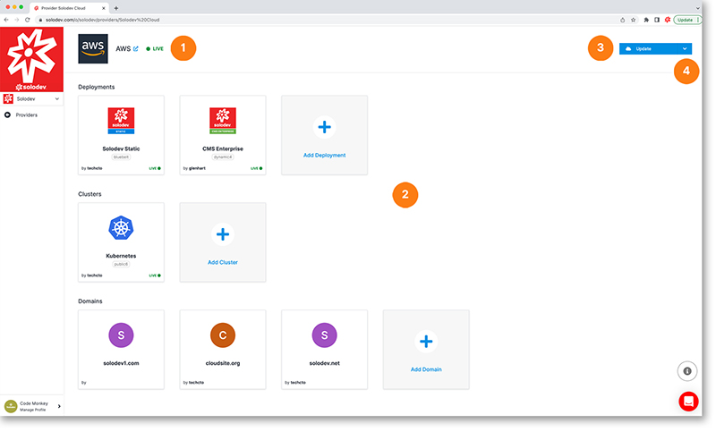

# Provider Details

The provider detail page shows you important provider details as well as the ability to update your provider.

1. Provider name, link to provider,  and provider status
2. Cards showing your deployments, clusters,  and domains associated with this provider (each clickable to access directly) and the ability to add more
3. Click on the blue update button to update or delete this provider
4. Click on the drop-down menu to modify permissions
	

	