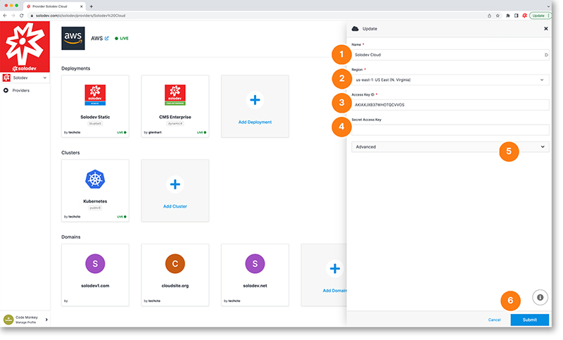

# Update or Delete Providers

The provider update modal allows you to modify your provider.

1. Change the domain of your provider
2. Change the region of your provider
3. Update your access key ID
4. Update your secret access key
5. Click the drop-down and follow the instructions to delete the provider
6. Click the blue submit button to apply the changes you make

