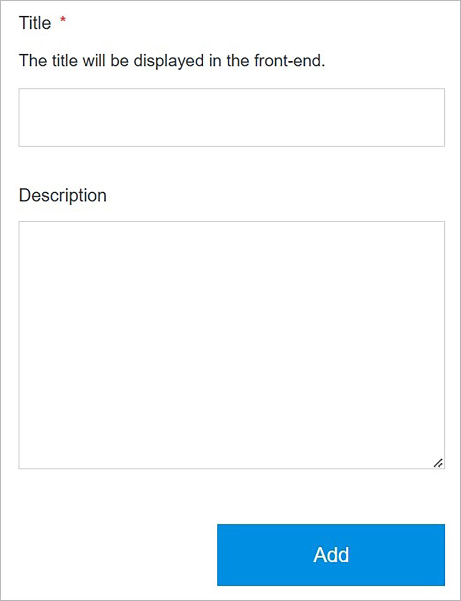

# Add Catalog

Adding a catalog in Solodev Cloud is a simple process, and can be completed in minutes.

</a>

**Name** | **Description** 
:--- | ---
Title | Type a catalog title.
Description | Enter the description of a catalog. (Optional)

## Confirm

Once you have completed all the fields, click **Add** to create your catalog.

!!!Note:
The catalog build process may take several minutes to complete after clicking the **Add** button. Do not close or quit your browser during this process.
!!!
