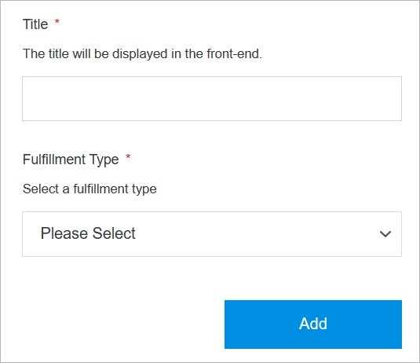

# Add Item

Adding an item to the catalog in Solodev Cloud is a simple process and can be completed in minutes.

</a>

**Name** | **Description** 
:--- | ---
Title | Enter the item title which will be displayed in the front-end.
Fulfillment Type | Select a fulfillment type

!!!Note:
You can choose from different 

- **Service:**  Third-party applications and cloud services.  
- **Infrastructure:** Deployments, clusters, and containers.
- **Add-Ons:** Apps, modules, themes, and actions available for CMS.
!!!

## Confirm

Once you have completed all the fields, click **Add** to create your item.

!!!Note:
The item addition process may take several minutes to complete after clicking the **Add** button. Do not close or quit your browser during this process.
!!!
