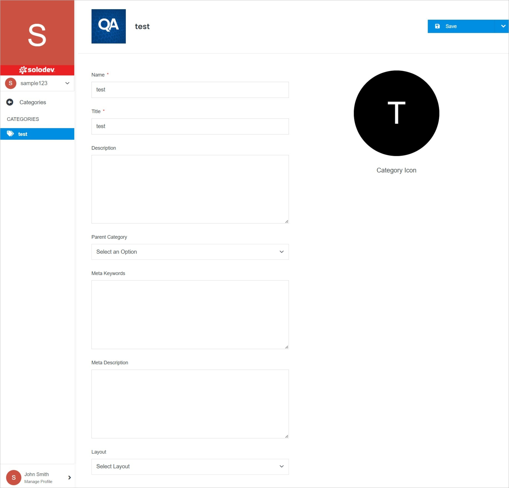
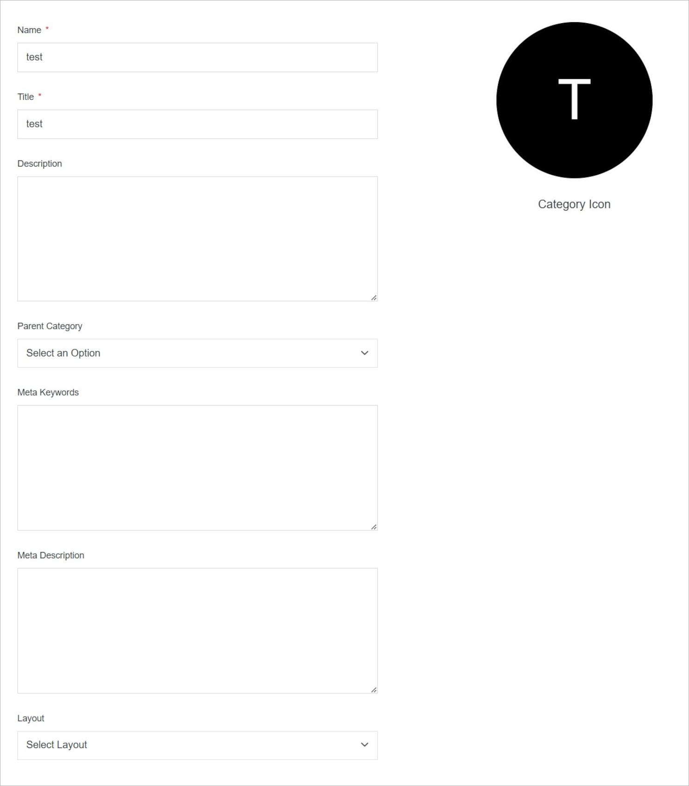

# Category Overview

The Category Overview page gives you the details of your category and the items in it.

</a>

**Name** | **Description** 
:--- | ---
<a href="/marketplace/catalogs/catalog-overview/categories/category-overview/#category-management">Category Management</a> | Manage your category features.
<a href="/marketplace/catalogs/catalog-overview/categories/category-overview/#category-icon">Category Icon</a> | Manage the category icon.
<a href="/marketplace/catalogs/catalog-overview/categories/category-overview/delete/">Delete</a> | Delete the category.
<a href="/marketplace/catalogs/catalog-overview/categories/category-overview/permissions/">Permissions</a> | Manage category permissions.

## Category Management

Manage your category features.

</a>

**Name** | **Description** 
:--- | ---
Name | Enter the category name.
Title | Enter the category title which will be displayed in the front-end.
Description | Enter the description.
Parent Category | Select the parent category.
Meta Description | Enter the meta description.
Layout | Select the layout. You can select the layout from: **Category**, **Default**, **Featured**, **List**.

## Category Icon

Create and manage the category icon.

</a>

**Name** | **Description** 
:--- | ---
Replace Image | Add an image by clicking **Replace Image** and choosing the file from your computer.

## Confirm

Once you have completed all the fields, click **Save** to apply your changes.
