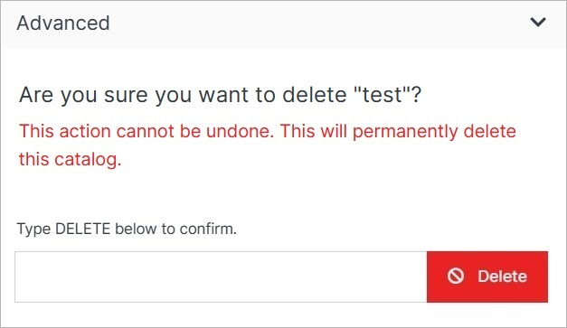

# Update

Update the catalog's details or delete the catalog.

</a>

**Name** | **Description** 
:--- | ---
Title | Enter the catalog's title.
Description | Enter the catalog's description.
AI Provider | Choose from the existing ones or add the new AI Provider.
Commerce Provider | Choose from the existing ones or add the new Commerce Provider.
Blockchain Provider | Choose from the existing ones or add the new Blockchain Provider.
<a href="/marketplace/catalogs/catalog-overview/update/#advanced">Advanced</a> | Go to the advanced options.

## Advanced

Under the Advanced dropdown, you can execute advanced operations such as deleting a catalog. 

</a>

**Name** | **Description** 
:--- | ---
Delete | To remove the catalog, type **DELETE** in all caps into the field and click the red Delete button.

!!! Note: 
Deleting a catalog will permanently remove the catalog and all of its content and cannot be undone.
!!!

## Confirm

Once you have completed all the fields, click **Submit** to apply your changes.

