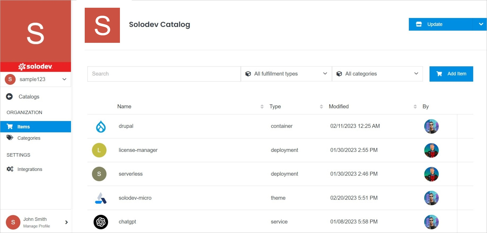

# Catalog Overview

The Catalog Overview page gives you the details of your catalog and the items in it.

</a>

**Name** | **Description** 
:--- | ---
<a href="/marketplace/catalogs/catalog-overview/add-item/">Add Item</a> | Add the new item to your catalog
<a href="/marketplace/items/item-overview/">Item Overview</a> | Click the item in your catalog to open it.
<a href="/marketplace/catalogs/catalog-overview/integrations/">Integrations</a> | Go to the Integrations page.
<a href="/marketplace/catalogs/catalog-overview/categories/">Categories</a> | Go to the Categories page.
<a href="/marketplace/catalogs/catalog-overview/update/">Update</a> | Edit catalog settings, delete the catalog.
<a href="/marketplace/catalogs/catalog-overview/permissions/">Permissions</a> | Manage your permissions.