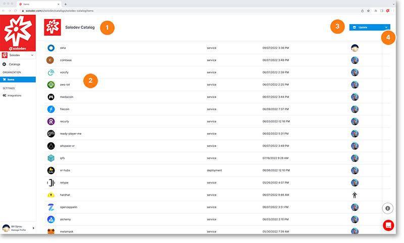

# Catalog Detail

The catalog detail page gives you the details of your catalog and the items in it. From this page you can:

1. See your catalog name
2. View the items in the catalog and click on them to open
3. Update and delete the catalog by clicking on the blue button
4. Update catalog permissions by clicking on the drop-down arrow
	

