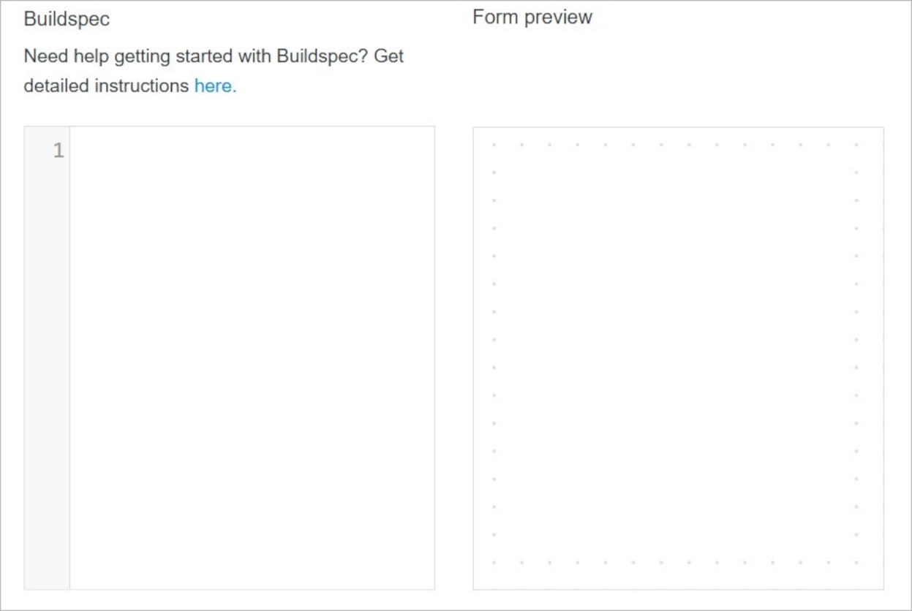
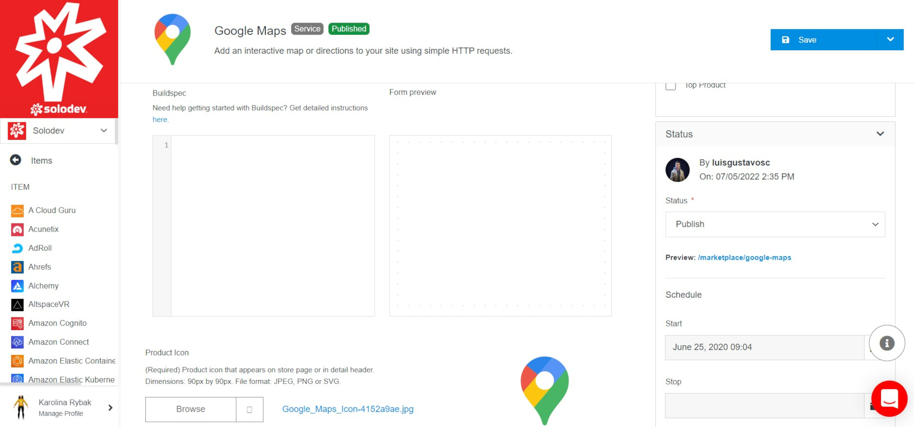

# Buildspec

Solodev Buildspec is a specialized set of build commands and settings for creating custom forms. With Buildspec, users can define form fields, capture form answers, and provide values for specific applications. It utilizes clear and simple YAML syntax and is being used in various places in the Solodev Cloud.

For example, users with a Marketplace Seller subscription can use Buildspec to customize their forms – allowing them to define the questions they need to ask buyers when configuring services in the Solodev Store. They can also use Buildspec to collect and pass values for various parameters in AWS CloudFormation Templates.

Anywhere that questions need to be asked – or answers provided – Buildspec can be used to customize a form and capture the necessary information.   

With Buildspec, you can put your form into a structure, using such elements as panels, columns, dividers, or headers.

The basic structure of the content follows this format:

!!!

form: // beginning the form definition section 
- id: {name} // unique identifier of the field 
    type: {field_type} // type of the field 
    label: {Some Label} // label connected with this field 
    description: {Test description for the name field} // helper text displayed under the label 
    required: {true|false} // requirement flag 
    autofocus: {true|false} // this field will gain focus right after the page load 
    hideLabel: {true|false} // if you need to turn off the label 
    placeholder: {Placeholder text} // useful with input or dropdown fields 
- id: {name} 
    ...

!!!

Using the build param, you can provide default values for questions asked in Cloud Formation Templates. The basic structure of the param looks like this:

!!!

build: // beginning of the build section 
-ParameterKey: AppVersion // key of the parameter 
 ParameterValue: latest // value of the paramter 
-ParameterKey: DatabasePassword 
...

!!!

**Field types**

Field types are different kinds of question formats that a user can assign to a form. The type section controls how the questions are formatted in the UI as well as the types of responses that are expected or required.

!!!Available formats include:

-hidden – No field will be shown in the UI, but the value will be stored in the form. 
-string – A textbox will be shown in the UI to capture the answer, and the answer will be formatted to a string. 
-clob – A text area will be shown in the UI to capture the answer, and the answer will be formatted to a multiline string. 
-email – Behaves just like a string type, but with e-mail address validation. 
-password – A password style of the textbox will be shown in the UI to capture the answer, and the value will be dotted and formatted to a string. 
-url – Behaves just like a string type, but with the URL validation. 
-boolean – A checkbox will be shown in the UI to capture the answer, and the answer will be entered as true if the checkbox is selected or false otherwise. 
-enum – A drop-down menu will be shown in the UI and the options section will be populated in the menu. The multiple options set to true will enable a multiple-choice type of drop-down, while the expanded option set to true will change the dropdown into a radio button group. 
-color – A color picker will be shown in the UI to capture the answer, and the answer will be formatted to the string with a # sign at the beginning. 
-date – A date picker will be shown in the UI to capture the answer, and the value will be formatted to the string. 
-tel – Behaves just like a string type, but with telephone number validation (ie. digits and dashes). 
-datetime – A date-time picker will be shown in the UI to capture the answer, and the value will be formatted to the string. 
-time – A time picker will be shown in the UI to capture the answer, and the value will be formatted to the string. 
-integer – A number picker will be shown in the UI to capture the answer, and the value will be validated to confirm if it is an integer. 
-money – Behaves just like a string type but with number validation and a  $ sign that precedes the textbox. 
-number – Behaves just like a string type but with number validation. 
-percent – Behaves just like a string type but with number validation and a  % sign that follows the textbox.

!!!

## Buildspec Management

Buildspec is available for use in the <a href="/marketplace/items/item-overview/">Item Overview</a> page.
There you can create and modify Buildspec formulas.

!!!Note:
The specificity of use Buildspec depends on the fulfillment type. In the all fulfillment types apart from **Service** you are able to modify Buildspec within the item versions.
!!!

**Service Fulfillment Type**

></a>

**Name** | **Description** 
:--- | ---
Formula | Enter the Buildspec formula.

**Example of formular 1**:

></a>

**Example of formular 2**:

></a>

**Rest of fulfillment types**

></a>

**Name** | **Description** 
:--- | ---
Formula | Enter the Buildspec formula.

## Confirm

Once you have completed all the fields, click **Save** to apply your changes.

