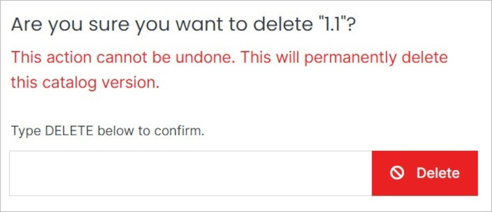

# Delete

Delete the version.
    
</a>

**Name** | **Description** 
:--- | ---
Delete | To remove the version, type **DELETE** in all caps into the field and click the red Delete button.

!!! Note: 
Deleting a version will permanently remove the version and all of its content and cannot be undone.
!!!
