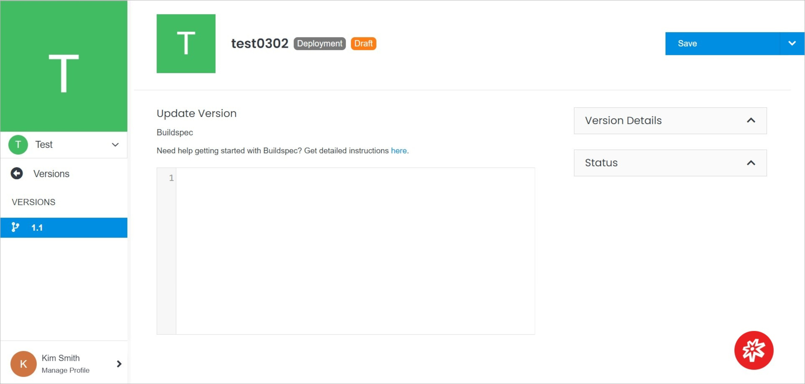
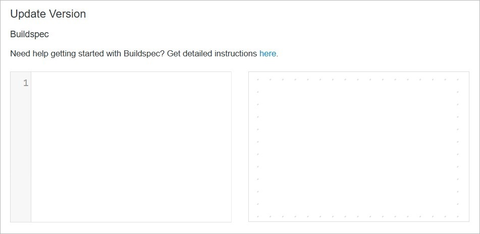
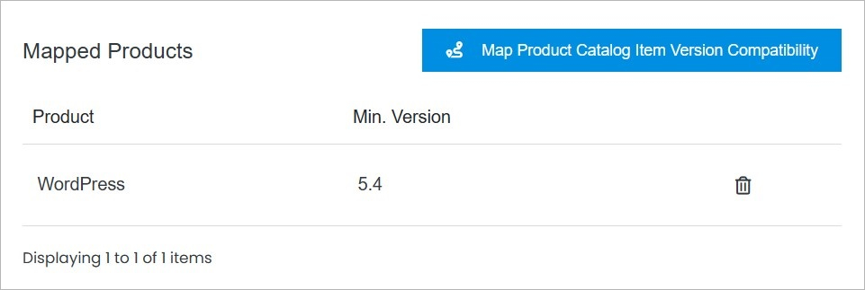
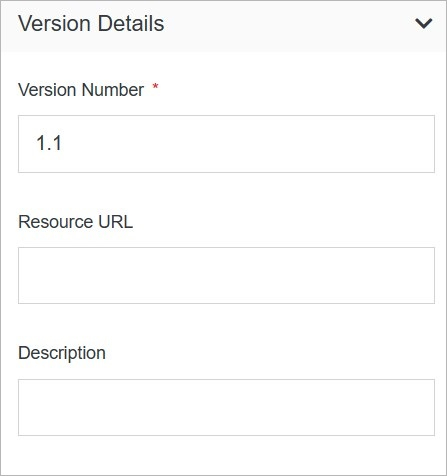
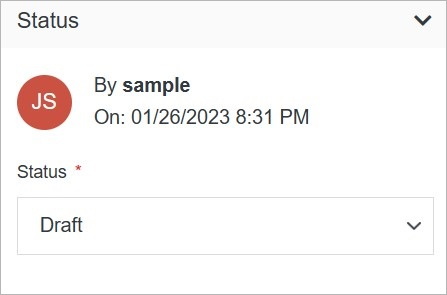

# Version Overview

Manage your item versions by managing its details and statuses, and more.

</a>

**Name** | **Description** 
:--- | ---
[Update Version](https://www.cloud.solodev.net/marketplace/items/item-overview/versions/version-overview/#update-version) | Update your version.
[Mapped Products](https://www.cloud.solodev.net/marketplace/items/item-overview/versions/version-overview/#mapped-products) | Manage your mapped products
[Version Details](https://www.cloud.solodev.net/marketplace/items/item-overview/versions/version-overview/#version-details) | Manage your version details.
[Status](https://www.cloud.solodev.net/marketplace/items/item-overview/versions/version-overview/#status) | Manage your version status.
<a href="/marketplace/items/item-overview/versions/version-overview/delete">Delete</a> | Delete the version.

## Update Version

Update your version.

</a>

**Name** | **Description** 
:--- | ---
Enter the code | Update your version with Buildspec.

## Mapped Products

Manage your mapped products.

</a>

**Name** | **Description** 
:--- | ---
<a href="/marketplace/items/item-overview/versions/version-overview/map-product-catalog-item-version-compatibility">Map Product Catalog Item Version Compatibility</a> | Map product catalog item version compatibility.
Delete Mapped Product | Click **Trash** button to delete the mapped product.

## Version Details

</a>

**Name** | **Description** 
:--- | ---
Version Number | Enter the version number.
Resource URL | Enter the resource URL.
Description | Enter the description.

## Status

</a>

**Name** | **Description** 
:--- | ---
Choose Status | Choose the item status.

!!!Note:
You can choose from three status types:

- **Publish**
- **Preview**
- **Draft**
!!!

## Confirm

Once you have completed all the fields, click **Save** to apply your changes.

