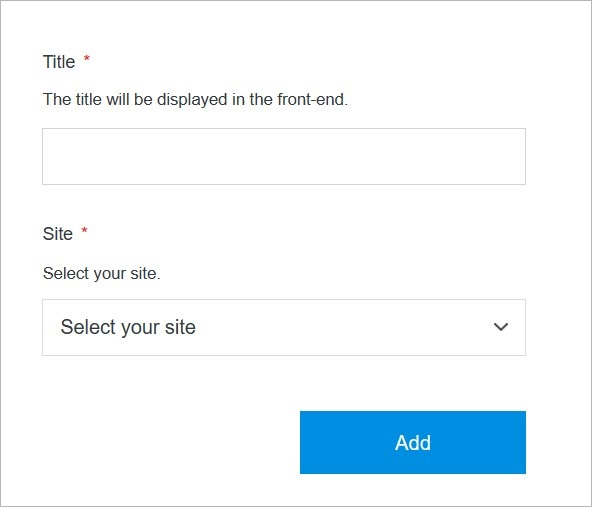

# Add Page

Adding a page in Solodev Cloud is a simple process, and can be completed in minutes by following the steps below.

</a>

**Name** | **Description** 
:--- | ---
Title | Add the page title.
Site | Select the site.

!!!Note:
Select a site from these that are already installed, or you can add a new site.
!!!

## Add

Once you have completed all the fields, click **Add** to create your page.

!!!Note:
The page build process may take several minutes to complete after clicking the **Add** button. Do not close or quit your browser during this process.
!!!

