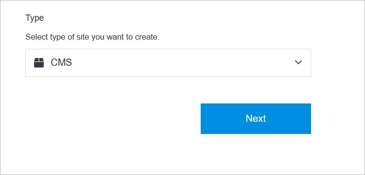
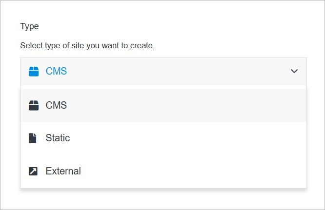
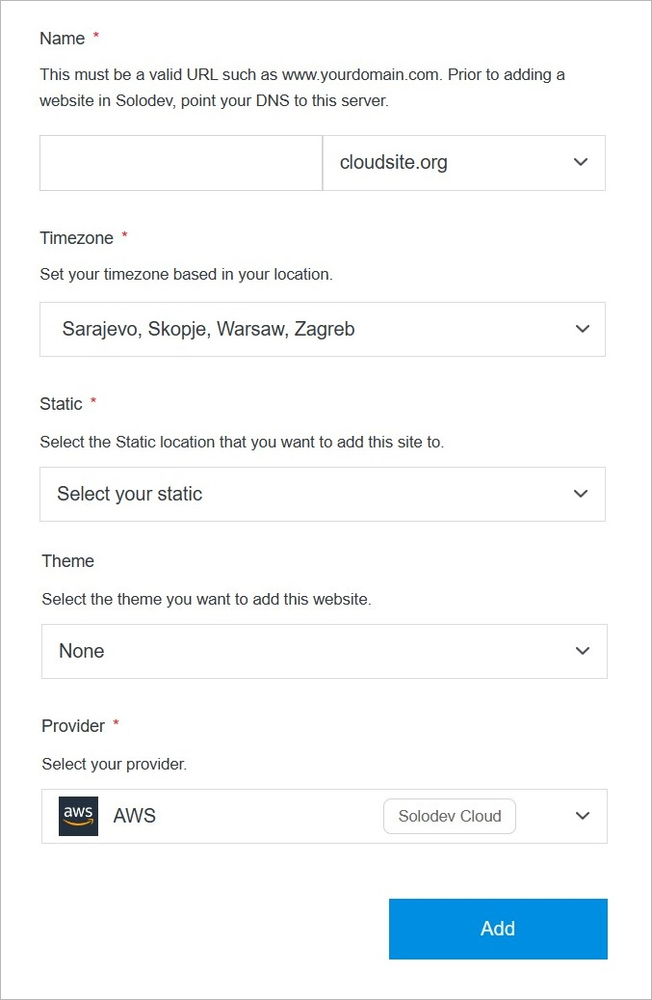

# Add Site

Adding a site is a simple process, and can be completed in minutes by following the steps below. 

</a>

</a>

**Name** | **Description** 
:--- | ---
Pick a Site Type | Choose one from the 3 site types.
Next | Go further after making a choice.

!!!Note:
You can choose from the 3 site types:

**[CMS:](https://cloud.solodev.net/pages/sites/add-site/#cms)** A CMS (Content Management System) let us create pages, build websites, publish content dynamically, and utilize data modules to streamline content operations. With a CMS, manage users and groups with permissions on a site or even a page level, allowing control and collaboration with the team on digital experiences. There are several CMS options to choose from in Solodev Cloud, including Solodev CMS and WordPress.

**[Static:](https://cloud.solodev.net/pages/sites/add-site/#static)** A static website uses server-side rendering to push pre-built HTML, CSS, and JavaScript files to a web browser. Static sites decouple the content repository from the front-end interface, giving greater flexibility with minimal cost to host and maintain. Sites launched with Solodev Static can be built and managed using our simple drag-and-drop editor.

**[External:](https://cloud.solodev.net/pages/sites/add-site/#external)** In addition to launching a CMS or a static site via Solodev Cloud, there is an option to connect an external site and manage the name, domain, login, and other variables within the Solodev Cloud account. 
!!!
---

## CMS

Create your site using CMS.

</a>

**Name** | **Description** 
:--- | ---
Name | Add a custom title to identify your website within your CMS deployment.
Timezone | Select a timezone for your website to help specify its location.
CMS | Choose a CMS for your website. Select from options that are purchased and ready to install, or you can add a new CMS from the Solodev Marketplace.
Theme (optional) | Add a theme package to your website. Select from options that are purchased and ready to install, or you can add a new theme from the Solodev Marketplace.

!!!Tip:
When adding a new domain, it must be a valid URL such as www.yourdomain.com. Before adding a website in Solodev, point your DNS to this server.
!!!

## Static

Create your site using Static.

</a>

**Name** | **Description** 
:--- | ---
Name | Add a custom title to identify your website within your Static deployment.
Timezone | Select a timezone for your website to help specify its location.
Static | Choose a Static for your website. Select from options that are purchased and ready to install, or you can add a new Static from the Solodev Marketplace.
Theme (optional) | Add a theme package to your website. Select from options that are purchased and ready to install, or you can add a new theme from the Solodev Marketplace.
Provider| Select your provider. If you have not already launched it, you can add a new provider from the Solodev Marketplace.

!!!Tip:
When adding a new domain, it must be a valid URL such as www.yourdomain.com. Before adding a website in Solodev, point your DNS to this server.
!!!

## External

Launch external site.

</a>

**Name** | **Description** 
:--- | ---
Name | Add a custom title to identify your website.
Timezone | Select a timezone for your website to help specify its location.

!!!Tip:
When adding a new domain, it must be a valid URL such as www.yourdomain.com. Before adding a website in Solodev, point your DNS to this server.
!!!

## Add

Once you have completed all the fields, click **Add** to create your site.

!!!Note:
The site build process may take several minutes to complete after clicking the **Add** button. Do not close or quit your browser during this process.
!!!
