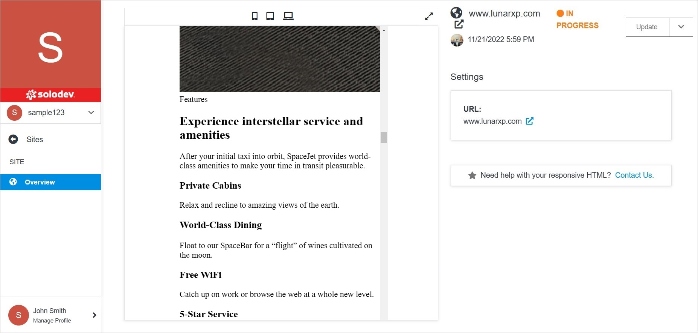

# Site Overview

The site detail page gives you a comprehensive overview of your site with convenient access to edits and functionality.

At the top, there are 3 icons, which can be used to change the site view. Maximize the window using the icon of doubled arrows on the right. 

</a>

**Name** | **Description** 
:--- | ---
<a href="pages/sites/site-overview/update/">Update</a> | Edit several site settings, delete the site.
<a href="pages/sites/site-overview/permissions/">Permissions</a> | Manage your permissions.

