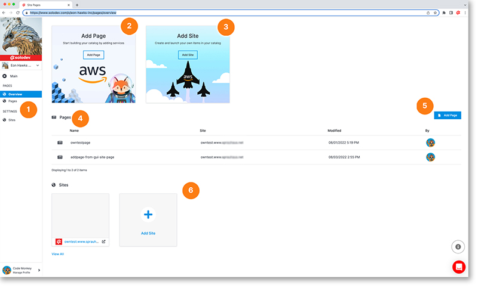

# Pages Overview

The pages overview is a where you can view and add pages and sites. Pages are individual web pages focused on a single topic whereas a site is a website comprised of multiple pages.

1. Main left nav to access the pages overview, page listings and sites
2. Click on this card to add a new page
3. Click on this card to add a new site
4. View a listing of your most recent pages
5. Click the blue "Add Page" button to add a new page
6. This row shows your existing sites and the ability to add a new site

