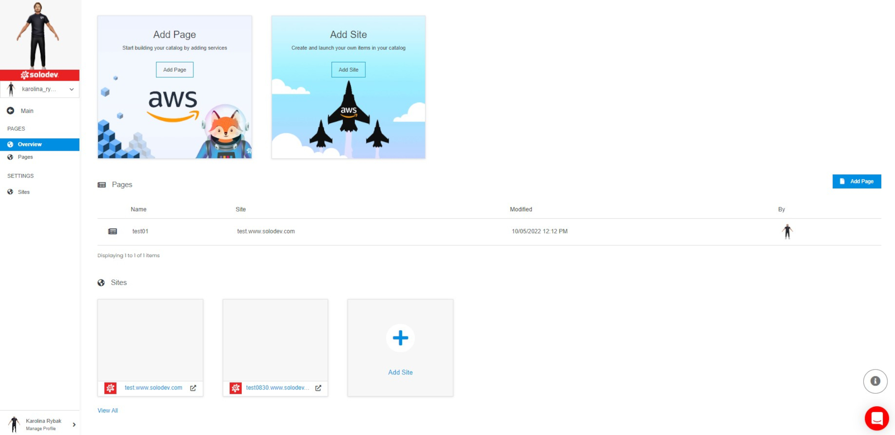

# Pages

To start building your catalog by adding services and create and launch items in your catalog, you need to use Pages section, where you are able to create your own pages and sites.

## Pages Overview

The pages overview is a where you can view and add pages and sites. Pages are individual web pages focused on a single topic whereas a site is a website comprised of multiple pages.

### Pages

Existing pages are listed in the table on the dashboard. Each page is shown with details as: name, site, when it was modified and by whom.

></a>

### Sites

Existing sites are shown as cards on the dashboard. Each card displays a thumbnail of the site, its name and is clickable to <a href="/pages/sites/read/">access the site</a> directly.

></a>

### Add Page

Click on the "Add Page" button on on the left photo or on the "Add Page" blue button on the right to <a href="/pages/pages/add-page/">add a new page</a>.

></a>

></a>

### Add Site

Click on the "Add Site" card to <a href="/pages/sites/read/">add a new site</a>.

></a>

### Menu

On the left there is a menu. You have the option to go back, go to pages or go to sites.

></a>