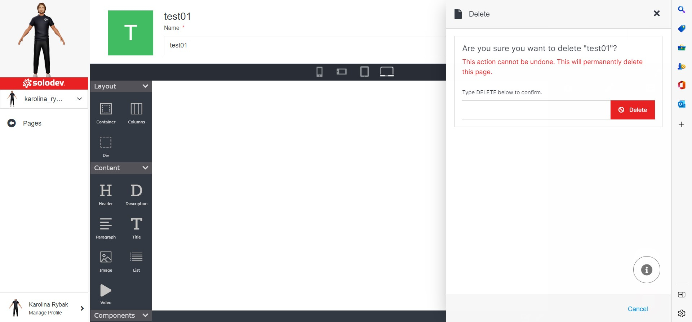

# Delete Page

Click on the "Advanced" drop-down option to expand the delete function. Type DELETE in all-caps in the text field and click the red "Delete" button to delete your page.

></a>

!!! Alert:
Deleting a page will permanently remove the page and all of its content and cannot be undone.
!!!