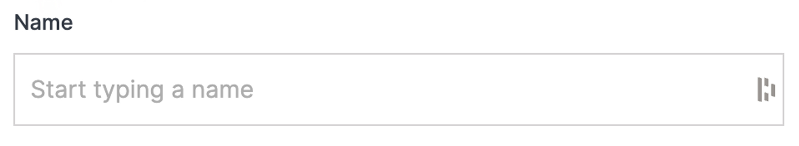

# Permissions

Permissions are a powerful tool that allows you to manage access for users and groups. User and group permissions can range from broad-scope team access to the fine granularity of single-user access to one single element. Permission modals exist for almost all cloud elements to help you organize and manage your organization and team(s).

---

## Add Permissions

### Step 1: Name

Enter the name of the user or group you would like to grant access. The text field is smart and will begin to display available users and groups to choose from as you type.

></a>

### Step 2: Role

Select the role you would like to apply to the chosen user or group. There are three options to choose from:

- **View:** The view role will only allow the chosen user or group the ability to see this item.
- **Editor:** The editor role will enable the chosen user or group the ability to see and edit this item.
- **Admin:** The admin role enables the chosen user or group the ability to see, edit and manage this item. This permission allows the ability to add or remove users and groups as well as the ability to modify or delete the entity.

></a>

### Step 3: Add and Manage

Click on the orange "+" button to add the user or group with the permissions selected. The newly added user will display in the list of active users below. Depending on your role, you can update a user or group's role by clicking on their current role and toggling between the options or removing their permissions by clicking on the "X" option to the right.

></a>

### Step 4: Submit

Click the blue "Submit" button at the bottom right to apply your changes.

></a>

!!!Please Note:
Any changes made above will not be applied unless the submit button is clicked.
!!!

