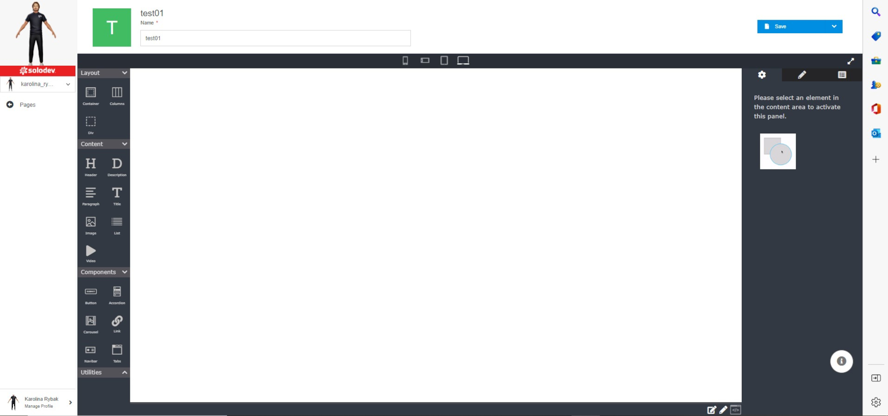
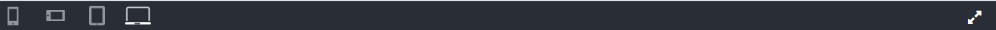
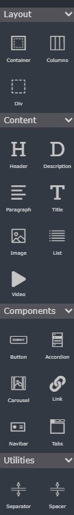

# Page Details

The page details page gives you a comprehensive overview of your page with convenient access to edits and functionality.

Your page detail utilizes our Page Studio editor. It has robust built-in drag-and-drop WYSIWYG editing functionality as well as the option to toggle to edit source directly.

></a>

## Step 1: Create from the scratch or update page in Page Studio editor

### Name

Edit your page name here.

></a>

### Preview

You can click on the device icons at the top to preview your site as it will respond to those screen sizes. You can also enlarge the preview to full-screen by clicking on the diagonal arrows at the top right of the preview screen.

></a>

### Edit

On the left panel there are elements to drag and drop consisting of:

   a. Layout elements
   b. Content elements
   c. Components
   d. Utilities

></a>

On the right panel there are three tabs to edit:

   a. Settings
   b. Layout
   c. Body
   
></a>

To start or stop editing page click on pencil icons. 

></a>

### Save

Click the blue save button to save any changes you have made to your page (note, the page does not auto-save so you must save changes you want to keep).

></a>