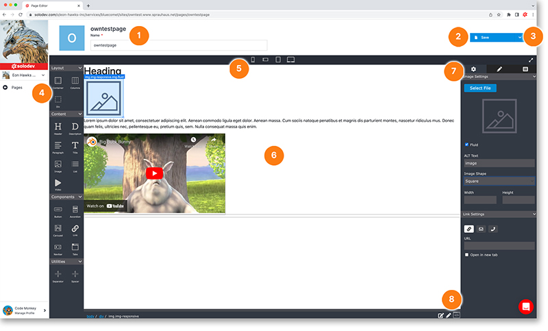

# Page Detail

Your page detail utilizes our robust built-in drag-and-drop editor. If you prefer, toggle to edit source code directly.

1. Edit your page name here
2. Click the blue save button to save any changes you have made to your page (note, the page does not auto-save so you must save changes you want to keep)
3. Click on the drop-down arrow to delete the page entirely
4. Left panel of drag and drop elements consisting of:
   a. Layout elements
   b. Content elements
   c. Components
   d. Utilities
5. Toggle between preview modes to see how your page will look on various screen sizes
6. Your page workspace
7. Right panel to edit your selected page element with three tabs to edit:
   a. Settings
   b. Layout
   c. Body
8. Toggle to source code editor view

