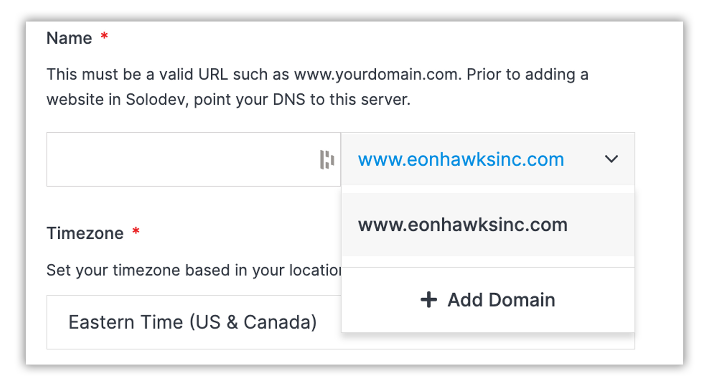

# Add Site
Adding a site is a simple process that requires you to follow a few sequential steps. First, you’ll be prompted to choose which type of site you would like from the drop-down menu. Once you select your site type, click the blue “Next” button to proceed.

</a>

## Types of Sites
There are three types of sites to choose from when adding a new site.

### CMS (Content Management System)
A CMS site is website that is built upon and managed by a CMS. Pages are generated dynamically and content can be customized to end users. There are several available tiers of Solodev CMS as well as other CMS industry leaders such as Wordpress available from the Solodev Marketplace. 

### Static
A static website uses server-side rendering to serve pre-built HTML, CSS, and JavaScript files to a web browser. Static sites enable you to decouple your content repository and front-end interface, giving you greater flexibility in how your content is served with the added benefit of minimal cost. Static sites launched through Solodev can be edited with our Page Studio WYSIWYG editor.

### External
Need definition here. Allaut volorendit adicae. Nem etus est volore iumque con consequidite sitatemquias sum et qui con excesci endamet facest explanis idel ipsus, sita expercimi, tem nimi, autatem odicae. 

!!!Please Note:
There are prerequisites required to add a new site. These prerequisites vary depending on site type and are noted with each respective input field.
!!!

## Add CMS Site
When choosing the option to add a CMS site you will be presented with the add CMS site form to get started. This form consists of five fields, four of which are required. Click on the tabs below for details on each field.
</a>

+++ Domain Name 
The first required field is for your domain name. Choose you’re a domain from your existing domains in the drop-down menu. Prior to adding a CMS site, you must have a valid domain name and point your DNS to this server.
</a>

If you do not currently have a domain name, you can choose the “Add Domain” option from the drop-down menu.
</a>
+++ Time Zone
The second required field is that of your time zone. Please select the appropriate time zone for your website from the drop-down menu.

+++ CMS
The third required field is to select your CMS. Select your CMS from the drop-down menu. +++

You must have an active and installed instance of CMS to add your site. If you do not have a CMS, select the “Add CMS” option from the drop-down menu.

+++ Cluster
The fourth required field is for your cluster. Choose your cluster from the drop-down menu.

You must have a cluster to associate your CMS site with. If you do not have a cluster, select the a “Add Cluster” option from the drop-down menu.

+++ Theme
The fifth step is to choose a customizable pre-built theme from our library for your website. You can select the theme for your site from the drop-down menu. This is not required and can be added later if needed.

+++ Add
Once you’ve completed all of the fields, click the blue “Add” button and your site will be created. 

!!!Please Note:
This process may take several minutes to complete. Do not close or quit your browser duing this process.
!!!
+++

## Add Static Site
When choosing...

## Add External Site
When choosing...
