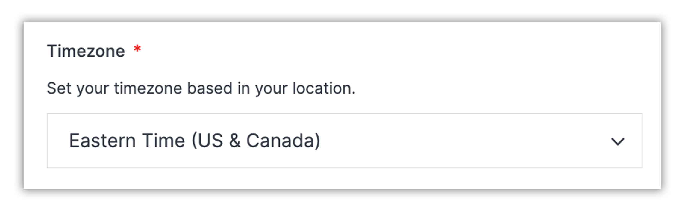
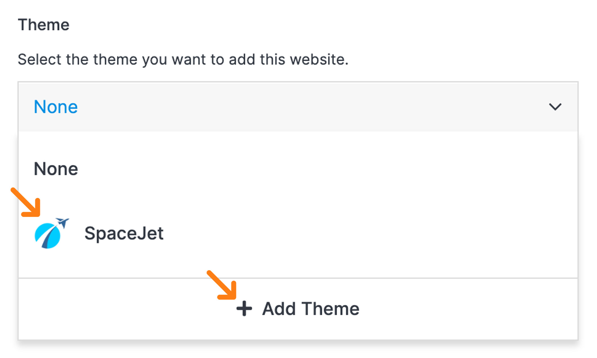

# Add Site

Adding a site to your org in Solodev Cloud is a simple process, and can be completed in minutes by following the steps below. 

## Step 1: Pick a Type

There are three types of sites to choose from when adding a new site.

</a>

**CMS:** A CMS (Content Management System) lets your team create pages, build websites, publish content dynamically, and utilize data modules to streamline your content operations. With a CMS, you can manage users and groups with permissions on a site or even a page level, allowing you to control and collaborate with your team on digital experiences. There are several CMS options to choose from in Solodev Cloud, including Solodev CMS and WordPress.

**Static:** A static website uses server-side rendering to push pre-built HTML, CSS, and JavaScript files to a web browser. Static sites decouple your content repository from your front-end interface, giving you greater flexibility with minimal cost to host and maintain. Sites launched with Solodev Static can be built and managed using our simple <a href="/pages/pages/read/">drag-and-drop editor</a>.

**External:** In addition to launching a CMS or a static site via Solodev Cloud, you can connect an external site and manage your name, domain, login, and other variables within your Solodev Cloud account. 

---

## Step 2: Add Site

### Add CMS Site

When choosing to add a CMS site you will be presented with the "Add CMS Site" form. This form consists of five fields, four of which are required to generate your new site.

#### Name (Required)

!!!Please Note:
A valid <a href="/infrastructure/domains/">domain name</a> is required.
!!!

Enter a name for your site in the blank field. Choose a domain from the drop-down menu on the right to associate with your site. You must have a valid <a href="/infrastructure/domains/">domain name</a> and point your DNS to this server. If you do not currently have a domain name, you can choose the "<a href="/infrastructure/domains/add/">Add Domain</a>" option from the drop-down menu.

></a>

#### Time Zone (Required)

Select the appropriate time zone for your website from the drop-down menu.

></a>

#### CMS (Required)

Choose your CMS from the drop-down menu. You must have a purchased and installed instance of CMS to add your site. If you do not have an active CMS, select the “Add CMS” option from the drop-down menu to take you directly to the content management section of the Marketplace.

></a>

#### Cluster (Required)

Choose your cluster from the drop-down menu. You must have a cluster to associate your CMS site with. If you do not have a cluster, select the a “Add Cluster” option from the drop-down menu to take you directly to the conatiners section of the Marketplace.

></a>

#### Theme

Choose a free customizable pre-built theme from the drop-down menu to easily add visual style to your site. If there are no themes present in your drop-down, click on the "Add Theme" option to select and install one from the marketplace. Once a theme is installed it will become an available option in the drop-down to apply to your new site. Choosing a theme is not required and can be performed later as needed.

></a>

#### Add

Once you’ve completed all of the fields, click the blue “Add” button and your site will be created. 

></a>

!!!Please Note:
The site build process may take several minutes to complete after clicking the "Add" button. Do not close or quit your browser duing this process.
!!!

---

### Add Static Site

When choosing to add a static site you will be presented with the "Add Static Site" form. This form consists of four required fields to generate your new site.

#### Name (Required)

!!!Please Note:
A valid <a href="/infrastructure/domains/">domain name</a> is required.
!!!

Enter a name for your site in the blank field. Choose a domain from the drop-down menu on the right to associate with your site. You must have a valid <a href="/infrastructure/domains/">domain name</a> and point your DNS to this server. If you do not currently have a domain name, you can choose the "<a href="/infrastructure/domains/add/">Add Domain</a>" option from the drop-down menu.

></a>

#### Time Zone (Required)

Select the appropriate time zone for your website from the drop-down menu.

></a>

#### Static (Required)

Select your instance of Solodev Static from the drop-down menu. You must have an active instance of Solodev Static to add your site. If you do not have Solodev Static, select the “Add Static” option from the drop-down menu to take you directly to the content management section of the Marketplace.

></a>

#### Provider (Required)

Choose your provider from the drop-down menu. You must have a <a href="/infrastructure/providers/">Provider</a> to host your static site with. If you do not have a provider, select the "<a href="/infrastructure/providers/add/">Add Provider</a>" option from the drop-down menu.

></a>

#### Add

Once you’ve successfully completed all of the fields, click the blue “Add” button and your site will be created. 

></a>

!!!Please Note:
The site build process may take several minutes to complete after clicking the "Add" button. Do not close or quit your browser duing this process.
!!!

---

### Add External Site

When choosing to add an external site you will be presented with the "Add External Site" form. This form consists of two required fields.

#### Domain (Required)

Enter a domain name for your site in www.yourdomainhere.com format. Do not include "http://" or "https://" when entering your domain. You must have a valid <a href="/infrastructure/domains/">domain name</a> and point your DNS to this server.

></a>

#### Time Zone (Required)

Select the appropriate time zone for your website from the drop-down menu.

></a>

#### Add

Once you’ve completed the fields, click the blue “Add” button and your site will be created. 

></a>
