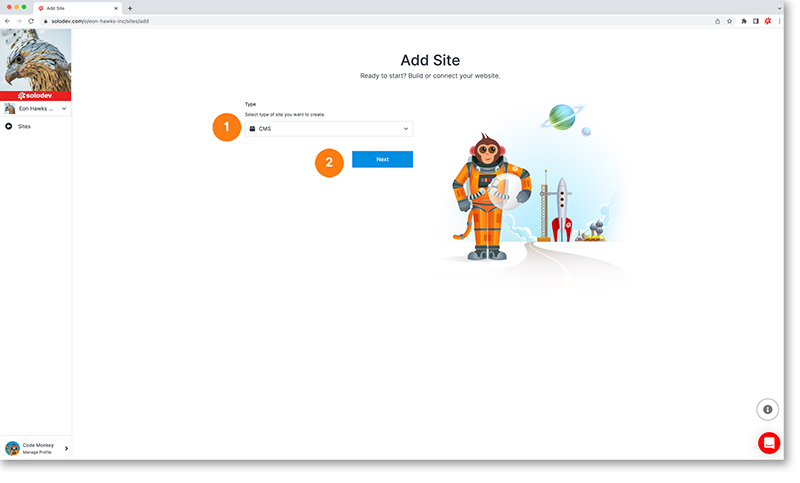
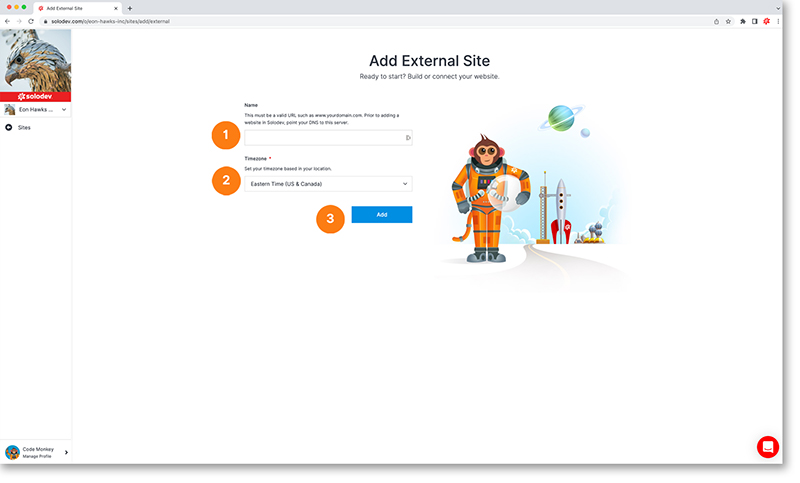

# Add Site

The add site page allows you to begin the process of adding a new site to your account. The first screen you’ll be prompted to choose which type of site to add before proceeding.

1. Choose which type of site you’ll be adding: CMS (Content Management System), Static or External (these three types of adds are described below)
2. Click the next button to advance

### Add CMS Site

The first option is the CMS option. This will allow you to add a new site to an existing CMS instance. If you do not currently have an existing CMS, you will need to add one prior to adding a site.

1. Provide the website domain. This must be a a valid URL. Prior to adding a site, please point your DNS to this server. If you would like to add a domain click the add domain option from the drop-down.
2. Select the proper time zone for your site
3. Select the CMS you want to add your site to from the drop-down menu or select the add CMS option if you do not currently have one
4. Select the cluster for your site or if you do not have one select the add cluster option
5. Select a pre-built, customizable theme from our library to apply to your site
6. Hit the add button to blast off

### Add Static Site

The second option is the Static site option. This will allow you to add a new static site to an existing static location. If you do not currently have an existing static location, you will need to add one prior to adding a site.

1. Provide the website domain. This must be a a valid URL. Prior to adding a site, please point your DNS to this server. If you would like to add a domain click the add domain option from the drop-down.
2. Select the proper time zone for your site
3. Select the static location you want to add your site to from the drop-down menu or select the add static option if you do not currently have one
4. Select your provider for the site or choose the add provider if you do not currently have one
5. Hit the add button to blast off
		

### Add External Site

The third option is the external site option. This will allow you to add a new static site to an existing static location. If you do not currently have an existing static location, you will need to add one prior to adding a site.

1. Provide the website domain. This must be a a valid URL. Prior to adding a site, please point your DNS to this server. If you would like to add a domain click the add domain option from the drop-down.
2. Select the proper time zone for your site
3. Hit the add button to blast off

