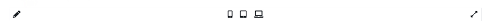
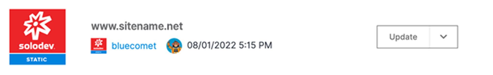
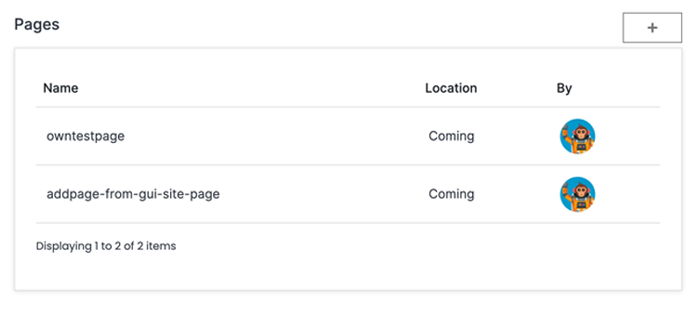

# Site Details

The site detail page gives you a comprehensive overview of your site with convenient access to edits and functionality.

></a>

---

### Preview and Edit

The left side of the site details page gives you a preview of the home page of your site. Clicking on the pencil icon at the top left will take you to the page editor. You can click on the device icons at the top to preview your site as it will respond to those screen sizes. You can also enlarge the preview to full-screen by clicking on the diagonal arrows at the top right of the preview screen. 

></a>

### Site Information, Update, and Permissions

The top right section of the page displays details of your site including your site's name, URL, hosting information, and last modification date. You can access the <a href="/pages/sites/update/">update site modal</a> by clicking on the "Update" button at the top right. You can access the <a href="/pages/sites/permissions/">site's permissions</a> by clicking on the down carat next to the "Update" button.

></a>

### View and Add Pages

The bottom right section of the page lists pages of your site. You can click on a page listing to open it in the page editor or click the "+" button to <a href="/pages/pages/add/">add a new page</a>.

></a>