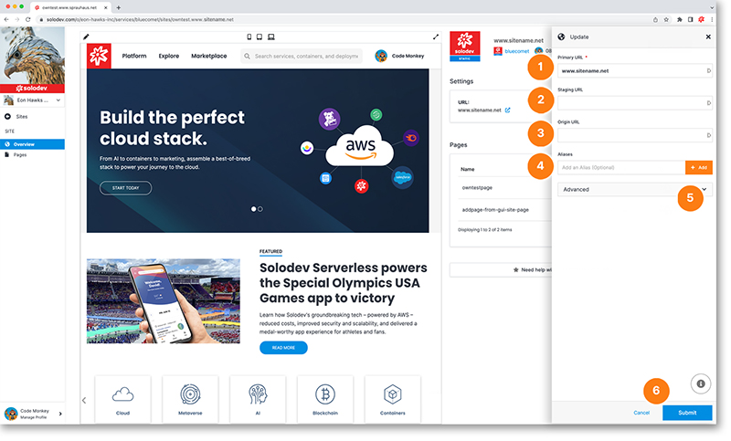

# Update or Delete Site

The update site modal gives you options to edit several settings and to delete the site.
    
1. Update your primary URL here
2. Update your staging URL here
3. Update your origin URL here
4. Add aliases here
5. Delete your site by clicking the drop-down option and following the delete instructions
6. Hit the blue submit button to apply your changes
	

