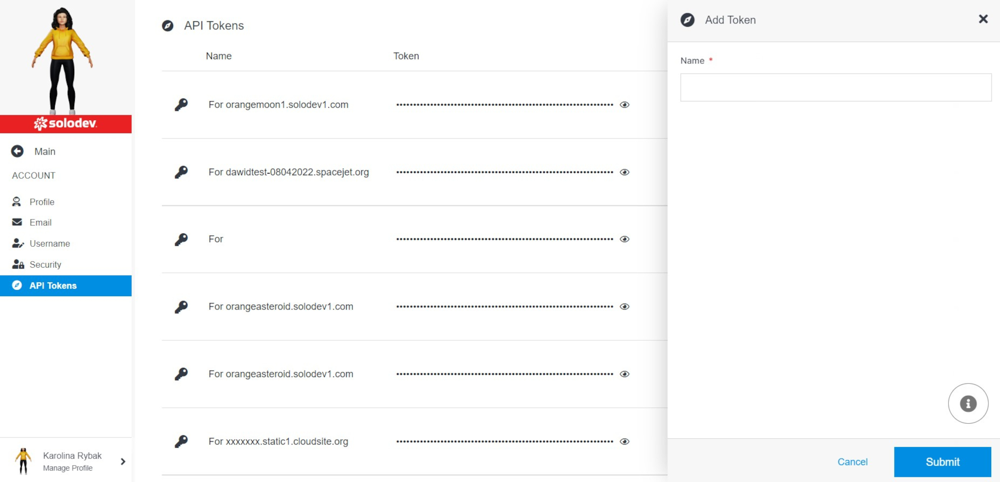
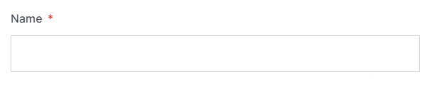

# Add API Key

Adding an API token to your org in Solodev Cloud is a simple process, and can be completed in minutes by following the steps below.

## Step 1: Add API Token

To add API token you need to provide a name for your token.

></a>

### Name

Enter the name you want to assign to your token.

></a>

### Submit

Click the blue "Submit" button at the bottom right to apply your changes.

></a>

!!!Please Note:
Any changes made above will not be applied unless the submit button is clicked.
!!!

