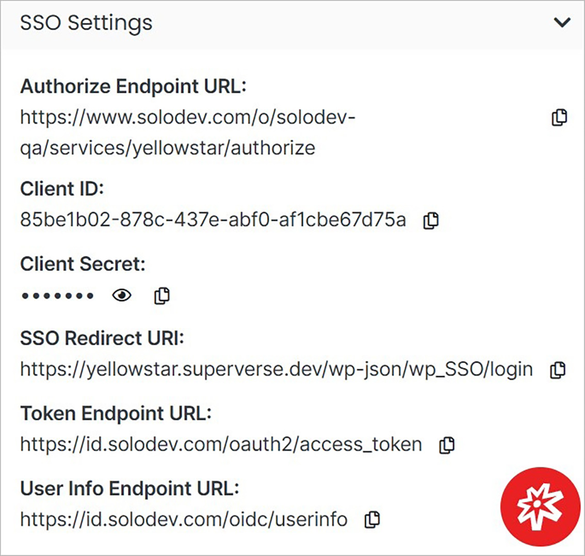

# Update

Manage SSO settings, delete the service.

</a>

**Name** | **Description** 
:--- | ---
<a href="/services/service-overview/update/#sso-settings">SSO Settings</a> | Manage the SSO Settings. 
<a href="/services/service-overview/update/#advanced">Advanced</a> | Manage the advanced settings.

!!!Note:
SSO Settings are not available in all cases.
!!!

## SSO Settings

Manage the SSO Settings.

Copy data by clicking the copy icon.

Unhide the Client Secret by clicking the eye icon.

</a>

## Advanced

Under the Advanced dropdown, you can execute advanced operations such as deleting a service. 

</a>

**Name** | **Description** 
:--- | ---
Delete | To remove the service, type **DELETE** in all caps into the field and click the red Delete button.

!!! Note: 
Deleting a service will permanently remove the service and all of its content and cannot be undone.
!!!
