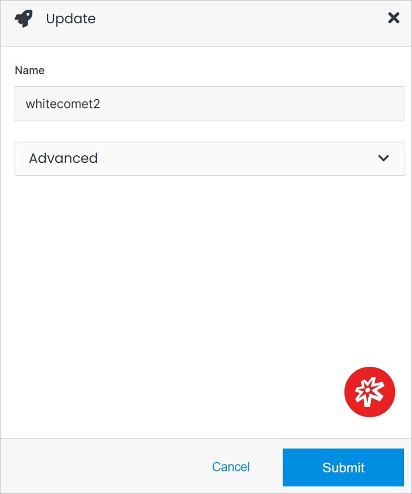
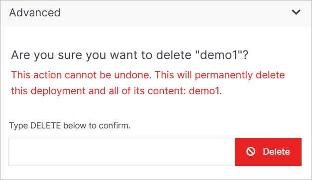

# Update

Under the **Update** option you can manage service settings and delete the service.

</a>

!!!Note:
In the case of this service, it is only possible to use the **Advanced** option, which includes **Delete**.
!!!

## Advanced

Under the Advanced dropdown, you can execute advanced operations such as deleting a service. 

</a>

**Name** | **Description** 
:--- | ---
Delete | To remove your service, type **DELETE** in all caps into the field and click the red Delete button.

!!! Note: 
Deleting a service will permanently remove the service and all of its content and cannot be undone.
!!!
