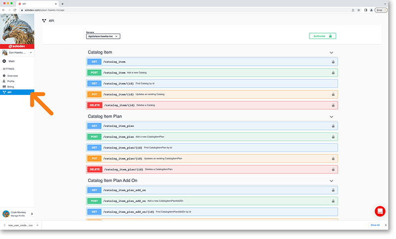

# API

An API is a way for two or more apps to communicate with each other. Today’s online world has moved from monolithic systems to microservices which are based on REST (RESTful) APIs.

The importance of efficient and reliable APIs cannot be overstated and is why Solodev utilizes Swagger. Swagger is a set of rules (specifications) and tooling to semantically describe APIs using a common language that is readable by both humans and machines. This means the same documentation can be shared with your team while also being used to automate API-dependent processes which is great for testing and debugging API problems. Any API that adheres to the Swagger specs is easy to read, easy to iterate, and easy to consume.

**Access Swagger API UI**

The API page will display the Swagger-UI which takes an existing JSON or YAML document and creates interactive documentation.

You can click the accordion to expand it and give you a full description of the parameters with an automatically generated example. This can be done for each method (get, put, post, delete).

**API Tokens**

To authorize yourself to gain access to Swagger click the authorize button at the top right of the screen. This will bring you to the available authorizations screen.

## API Authorization

There are two options for authorization: **Bearer** and **UserApiToken**.

**Bearer Authentication:**  

Bearer Authentication (also called token authentication) is an HTTP authentication scheme that involves security tokens called bearer tokens. The name “bearer authentication” can be understood as “give access to the bearer of this token” the token is a cryptic string usually generated by the server in response to a login request. The client must send this token in the authorization header when making requests to protected resources.

**User Authentication:**

The second option is the UserApiToken (apiKey) which is the scenario we will detail here. 

!!!
***Please Note:** To get your user token please go to your user profile page and click on the API Tokens menu in the left nav. Choose the token you want, copy the key and return to this screen to paste it in.*
!!!